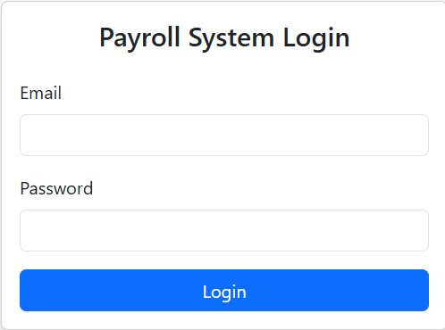
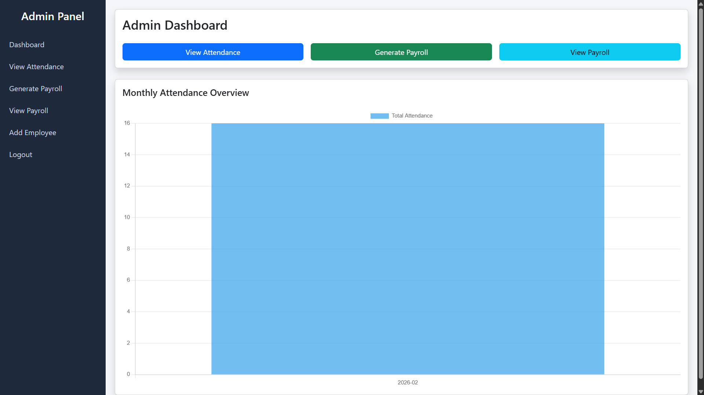
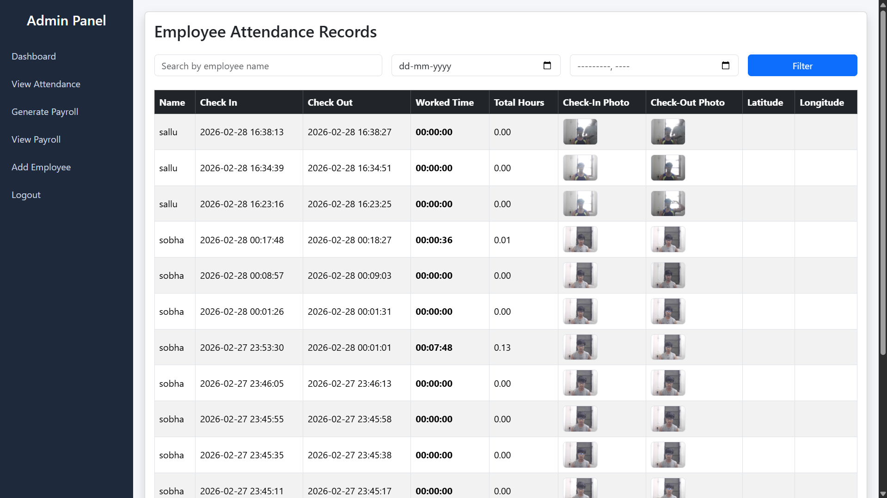
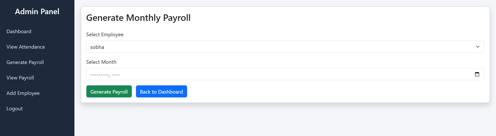
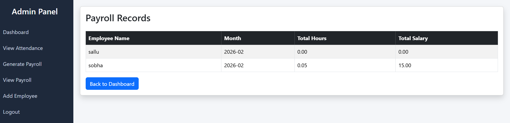
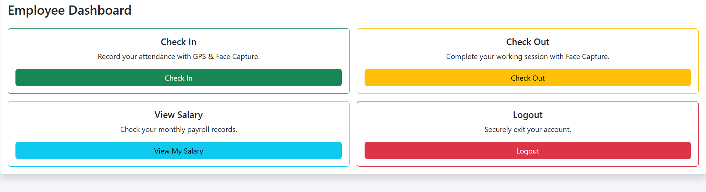

# Automated Payroll System

A complete web-based Payroll & Attendance Management System built using PHP, MySQL, Bootstrap, and Chart.js.

---

## 🚀 Features

- Role-Based Authentication (Admin & Employee)
- GPS-Based Check-In
- Face Capture at Check-In & Check-Out
- Exact Work Time Calculation (HH:MM:SS)
- Monthly Payroll Generation
- Admin Attendance Filter & Search
- Attendance Analytics Chart (Chart.js)
- Sidebar Admin Panel Layout
- Auto-Hide Alerts
- Modal Image Preview
- Secure Employee Registration (Admin Only)

---

## 🛠 Tech Stack 

- PHP
- MySQL
- Bootstrap 5
- JavaScript
- Chart.js
- XAMPP

---

## 📦 Installation Guide

1. Clone the repository
2. Import `database.sql` into phpMyAdmin
3. Rename `config/db_example.php` to `config/db.php`
4. Update database credentials inside `db.php`
5. Start Apache & MySQL using XAMPP
6. Run the project in browser

---

## 👨‍💻 Author

Developed by **Pradip Dhakal**

---

## 📌 Future Improvements

- Export Attendance to Excel
- Download Salary Slip PDF
- Employee Edit/Delete Management
- Dark Mode UI

## 📸 Project Screenshots

### 🔐 Login Page

### 📊 Admin Dashboard

### 📋 Attendance Records

### 💰 Generate Payroll

### 📈 View Payroll

### 👤 Employee Dashboard

